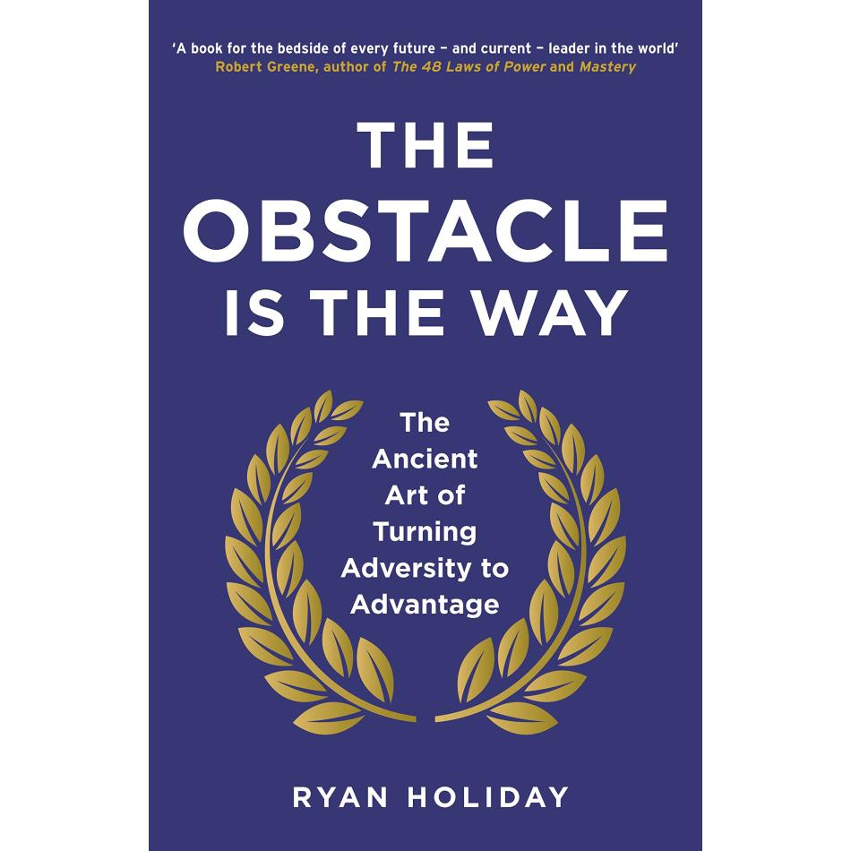
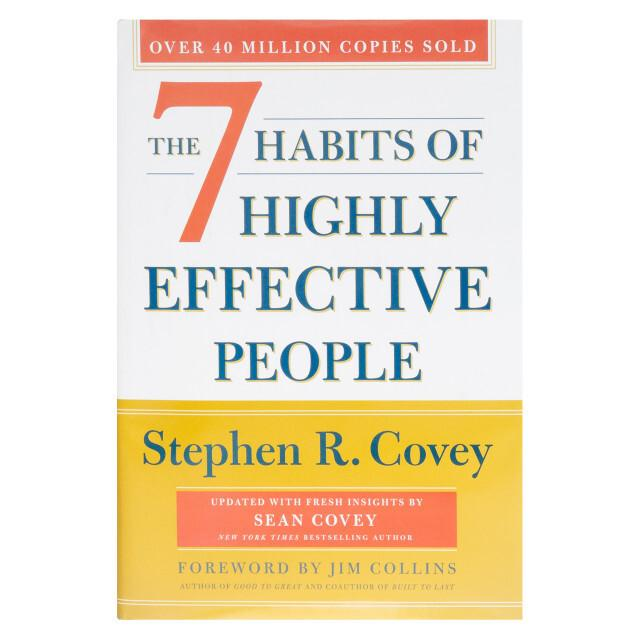
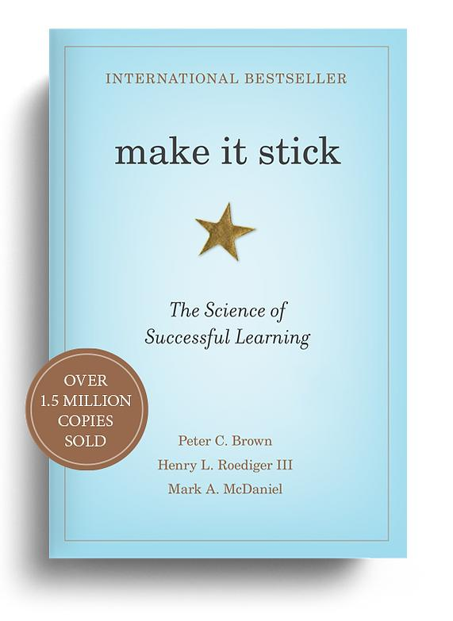

# Week 01 — Success Mindset (Mindset OS)

Part of the DevOps Micro Internship (DMI) with Agentic AI

---

## Purpose (Read This First)

This week is not motivation homework.

This is you building your **Mindset OS** — the system you will use for the next 5 months (and honestly, for years).

### Expectations

* Be honest.
* Be specific.
* Be practical.
* Write like an adult professional: clear sentences, no one-liners.

You will reuse this in later weeks. So do it properly once.

---

# Assignment 1. What is something you believe to be true that most people around you would disagree with?

### Rules

* No "safe" answers.
* Must be your real belief (not copied from internet).
* Minimum 50 words.

**Hint:** What do you believe about career, money, learning, discipline, relationships, health, success, life, tech industry, etc. that most people don't agree with?

## Answer

People often say, “Practice makes a man perfect,” but practice alone is not enough. We need to practice the right way to get better. Hard work is important, but if we are working in the wrong way, it may not help us succeed. So, success is not only about working hard. It is also about doing the right things, learning from our mistakes, and trying to get better every day.

---

# Assignment 2. What are the top 3 objective truths you discovered through experimentation and results?

### Definition

Objective truths do not depend on opinions. They hold true regardless of how people feel.

Write each truth in this format:

**Truth:** (1 sentence)

**Evidence from my life:** (2–4 lines: what you tried + what happened)

---

## Truth #1

### Truth

Others can cloud your judgement about people pretty easily, if you're not careful.

### Evidence from my life

Sometimes, we lose good people because we care too much about what others say. We start ignoring the people who truly care about us. So, we should trust ourselves and value the people who are always there for us.

---

## Truth #2

### Truth

Every day, people start their day with different moods and feelings.

### Evidence from my life

Motivation can help us for some time, but it slowly fades away. So, don’t depend only on motivation. Build discipline and keep working even when you don’t feel motivated.

---

## Truth #3

### Truth

People notice what they see. So, if you want people to know about your work, you need to show it.

### Evidence from my life

You may be talented, but if you don’t show your work, someone else may get the credit. So, let people see what you can do.

---

# Assignment 3. What does your 2.0 version look like?

### Instructions

Write as if a journalist is writing about you **3 to 7 years from now** (not 20 years).

**Minimum 300 words.**

### Rules

* Write in past tense, like it already happened.
* Don't use "likes to / wants to / hopes to."
* Use specifics:

  * built
  * shipped
  * led
  * published
  * earned
  * relocated
  * contributed
* Include skills proof:

  * projects
  * portfolios
  * GitHub
  * blogs
  * certifications
  * job role
  * leadership
  * community contribution
* Add 1–3 images if you can (optional but powerful).

### Publish It Publicly On Any ONE

* LinkedIn
* Medium
* WordPress
* Blogspot
* Personal blog
* Portfolio page

Use the credit note that matches your track:

Add the following credit note at the end of your post **(If you are DMI Cohort 3 student)**:

> **P.S. This post is part of the DevOps Micro Internship (DMI) with Agentic AI — Cohort 3 — by [Pravin Mishra](https://www.linkedin.com/in/pravin-mishra-aws-trainer/). My graded progress is public: https://dmi.pravinmishra.com/s/YOUR-GITHUB-USERNAME.html · Start your DevOps journey: https://dmi.pravinmishra.com/?utm_source=student&utm_medium=ps-blog&utm_campaign=cohort3**

**Tag [Pravin Mishra](https://www.linkedin.com/in/pravin-mishra-aws-trainer/) in your LinkedIn post, then tag Lead Co-Mentor — [Anjana Muthunayake](https://www.linkedin.com/in/anjana-muthunayake/).**

Add the following credit note at the end of your post **(If you are DMI Self-paced track student)**:

> **P.S. This post is part of the DevOps Micro Internship (DMI) — Self-Paced Engineer Track — by [Pravin Mishra](https://www.linkedin.com/in/pravin-mishra-aws-trainer/). My graded progress is public: https://dmi.pravinmishra.com/s/YOUR-GITHUB-USERNAME.html · Start your DevOps journey: https://dmi.pravinmishra.com/?utm_source=student&utm_medium=ps-blog&utm_campaign=self-paced**

Add the following credit note at the end of your post **(If you are DMI Campus student)**:

> **P.S. This post is part of the DevOps Micro Internship (DMI) — Campus — by [Pravin Mishra](https://www.linkedin.com/in/pravin-mishra-aws-trainer/). My graded progress is public: https://dmi.pravinmishra.com/s/YOUR-GITHUB-USERNAME.html · Start your DevOps journey: https://dmi.pravinmishra.com/?utm_source=student&utm_medium=ps-blog&utm_campaign=campus**

**Tag [Pravin Mishra](https://www.linkedin.com/in/pravin-mishra-aws-trainer/) in your LinkedIn post, then tag Lead Co-Mentor — [Anjana Muthunayake](https://www.linkedin.com/in/anjana-muthunayake/).**

Hashtags:

#DMIByPravinMishra #AgenticAI #DevOps

## Your Article

🚀 **What Does My 2.0 Version Look Like?**

A few years from now, I see myself as a confident Full Stack Web Developer with good knowledge of DevOps and cloud technologies.

My journey started with basic coding. I learned HTML, CSS, JavaScript and slowly moved towards React, Node.js, databases and backend development.

By then, I had built and shipped several web projects and added them to my portfolio and GitHub. My GitHub showed my projects and the progress I made over the years.

I had also worked as a Full Stack Developer in a company. I worked with a team, contributed to real projects, fixed bugs, worked with APIs, and learned how to deploy applications.

Along with my job, I had published simple blogs about coding and helped beginners understand difficult topics in an easy way. I had also earned certifications related to web development, cloud and DevOps.

I had also taken part in developer communities and helped juniors with their coding problems.

The biggest change was not only in my technical skills. I had become more disciplined, confident and consistent.

My 2.0 version was not perfect. It was simply a better version of me who kept learning, improving and moving forward. 💻🚀

#DMIByPravinMishra #AgenticAI #DevOps

### Public Link

Paste your link here:

`https://lnkd.in/p/dJqyxNBN`

---

# Assignment 4. Have you ever cut corners (unethical / dishonest / shortcut behavior — not necessarily illegal)? If yes, how did it make you feel?

### Important

You don't need to write the full story.

Focus on the feeling:

* guilt
* fear
* shame
* stress
* regret
* numbness
* etc.

This is about self-awareness, not judgment.

### Answer Format

**Yes / No**

If Yes:

**What emotion did you feel?** (minimum 50–100 words)

## Answer

Sometimes, I took shortcuts when I had less time to finish a project or assignment. The work got completed, but I was not fully happy with it. I often felt that I had focused more on finishing the work than actually learning it. This made me realize that shortcuts may save time, but they do not help us learn properly. Now, I try to understand things, do the work myself, and learn from the process.

---

# Assignment 5. What are 10 non-fiction books you plan to read in the next 1 year?

### Rules

* Mention **Title + Author**
* Any language allowed
* No fiction novels

### Tip

Choose books that improve:

* mindset
* communication
* productivity
* health
* money
* career
* leadership

## Book List

1. The Almanack of Naval Ravikant — Eric Jorgenson

2. The Comfort Crisis — Michael Easter

3. Deep Work — Cal Newport

4. The Psychology of Money — Morgan Housel

5. The Obstacle Is the Way — Ryan Holiday

6.  How to Win Friends and Influence People — Dale Carnegie

7. The 7 Habits of Highly Effective People — Stephen R. Covey

8. Make It Stick — Peter C. Brown

9. The Personal MBA — Josh Kaufman

10. Atomic Habits — James Clear

---

# Assignment 6. What are the things you will measure regularly in your life and career?

### Rules

List topics only. No need to share numbers.

### Must Include

* Learning / skill
* Output / proof
* Health / energy
* Time / focus
* Money / finance (personal or business)

### Example

* Learning hours per week
* Deep work sessions per week
* Projects shipped / documented
* Steps / workouts
* Sleep hours
* Spending tracker

## My Metrics

* New skills I learned every week
* Projects I finished and added to my portfolio
* How regularly I completed my weekly goals
* Time I spent learning DevOps, Cloud, and AI
* My sleep, exercise, health, and daily energy
* My relationships with friends and other people
* How well I used my time and stayed focused
* How I handled problems and difficult situations
* How clearly I spoke and communicated with others
* My progress in completing my Computer Science degree

---

# Assignment 7. Brain Dump + 5-Month System Plan

## Step 1: Brain Dump (Private)

Do a brain dump of everything in your mind into a notebook.

Examples:

* Bills
* Tasks
* Worries
* Goals
* Pending messages
* Ideas
* Responsibilities

### Did You Do It?

**Yes / No**

Answer:

Yes

---

## Step 2: Your 5-Month Routine + Focus Blocks

Create a simple plan you can realistically follow for the next 5 months.

### Weekly Routine

Example:

* Mon–Thu: 60 min deep work
* Sat: DMI session
* Sun: Weekly review

#### My Weekly Routine
Monday–Thursday: 60 Minutes — Technical Learning
9:00–10:00 PM

Work on one main topic at a time:

* AI
* Backend and APIs
* Docker and DevOps
* Personal Projects

Rule: Build more, watch fewer tutorials.

Learn something only when you need it for your current project. Try to use what you learn instead of only watching videos.

 Friday: 30–45 Minutes — Communication

9:00–9:45 PM

Choose one activity:

* Write about a technical topic
* Improve my LinkedIn or GitHub
* Read something aloud and explain it
* Write about a project I built

Goal: I should be able to explain my work clearly, not just do the work.

Saturday: 1.5–2 Hours — DMI + Project

Afternoon or Evening

* **1 hour:** Complete DMI work
* **30–60 minutes:** Use what I learned in my own project

I should not do DMI only to get a certificate. I should learn something useful from every session and use it in my projects.

 Sunday: 30 Minutes — Weekly Review

8:00–8:30 PM

Ask myself these four questions:

1. What did I build this week?
2. What new thing did I learn?
3. Where did I waste my time?
4. What is the one important thing I need to do next week?

After that, plan the four study sessions for the next week.

---

### Focus Blocks

#### When Will You Do DMI Work? (Days + Time)

Everyday for 4 hours excluding live sessions and class

#### How Many Sessions Per Week?

I will literally commit part of every single day to DMI work. At least a session every day.

---

### Distraction Rules

Examples:

* Phone rules
* Social media rules
* Environment setup

#### My Distraction Rules

* Discipline: Focus on my long-term goals instead of short-term fun or distractions.
* Accountability: Check my daily goals every morning and see if I completed them.
* Entertainment: Watch movies, play games, and relax only during my free time.
* Social Media: Use social media mainly for learning, connecting with people, and sharing my work.

---

# Reflection – Week 1

### Biggest insight I got about myself this week

I often spend too much time looking for better tools, plans, and ways to learn. It can feel useful, but sometimes it is just a way to avoid doing the actual work. I already know enough to start making progress. Now, I need to stop changing my plan again and again and focus on doing the work regularly.

Having potential is not enough. What really matters is what I do every day.

### My biggest weakness/loop I noticed

I get excited about new ideas and sometimes try to do too many things at once.

I can learn things quickly and make good plans, but following them every day is harder. I often look for new things instead of doing the basic work that helps me grow.

I have learned that thinking about getting better is not enough. I need to actually do the work every day.

### One system I will implement from this week (exact habit + time)

Every night before going to bed, I will spend 30 minutes checking my progress.

20 minutes: Work on my most important skill or project. I will avoid tutorials unless I really need them.

5 minutes: Write down what I actually completed that day.

5 minutes: Choose the most important task for tomorrow and write the first step I need to take.

### LinkedIn Post

Paste your LinkedIn post link here:

`https://lnkd.in/p/dR_4fmZH`

---

## 10. Proof of Work

- LinkedIn Post URL: [**Noman Ahamd linkdin**](https://lnkd.in/p/dR_4fmZH)  
- Blog / Medium : [**Noman Ahmad Blog**](https://medium.com/@ahmadnoman6969/what-i-learned-from-my-first-week-of-dmi-fa2e149ce2bb)  

---

## 📌 About DMI & CloudAdvisory

DevOps Micro Internship (DMI) is a project-based DevOps program run by Pravin Mishra (The CloudAdvisory) focused on real-world execution, systems thinking, and career readiness.

It helps learners build strong DevOps foundations with hands-on experience.

## 📌 Resources

- 🌐 **DMI Official Website:** https://dmi.pravinmishra.com?utm_source=github&utm_medium=readme  
- 🎓 **University:** https://university.pravinmishra.com?utm_source=github&utm_medium=readme  
- 💬 **Discord Community:** https://discord.pravinmishra.com?utm_source=github&utm_medium=readme  
- 📝 **Blog:** https://dmi.pravinmishra.com/blog?utm_source=github&utm_medium=readme  
- ▶️ **YouTube Playlist (DMI Cohort 3):** https://www.youtube.com/playlist?list=PLFeSNDtI4Cho  
- 🔗 **Pravin Mishra (LinkedIn):** https://www.linkedin.com/in/pravin-mishra-aws-trainer/  
- 🏢 **CloudAdvisory (LinkedIn):** https://www.linkedin.com/company/thecloudadvisory/

---

*This submission is part of DevOps Micro Internship (DMI) — Agentic AI Track*